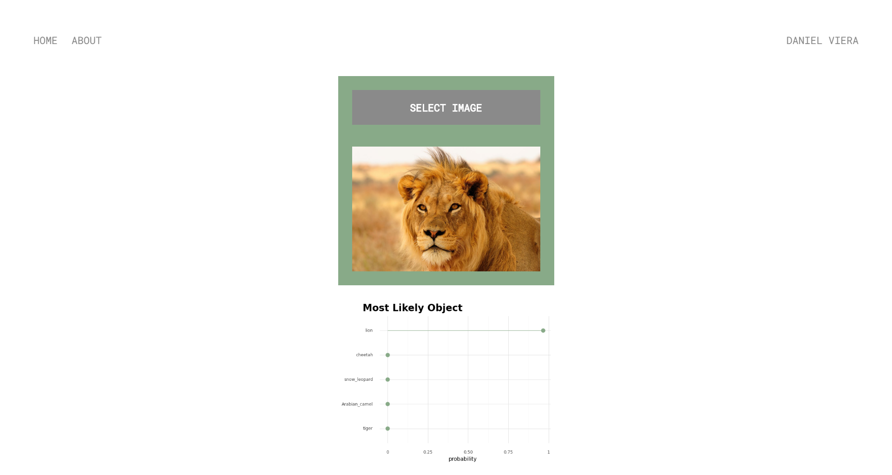

# Web Application using FastAPI

Web app using FastAPI, Tensorflow 2.0 and plotnine. JQuery was used to send the form request and render html templates.

To run the app: uvicorn server:app --reload
